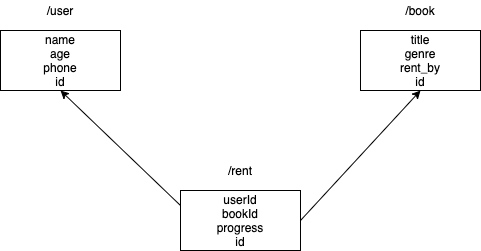

# ReactAdmin-Announcement
React로 어드민을 작성하기 위한 프레임워크인    
React-Admin에 대해   캐시워크에서 발표된 자료입니다.
## 디렉토리 구조 설명
 - **발표자료**              
  발표할때 사용한 프레젠테이션 파일 및 이미지를 담는다 
    
 - **comic-client**   
  발표시 샘플로 사용한 만화방 예제의 클라이언트측 코드  
    
 - **comic-server**    
  발표시 샘플로 사용한 만화방 예제의 서버측 코드  
    
 - **react-admin-demo**   
  발표시 List 뷰 컴포넌트의 커스터마이즈를 설명하기 위해 사용한
리액트 어드민에서 제공하는 공식 데모 소스 코드  
리액트 어드민을 더 잘 이해하고 싶다면 Doc의 튜토리얼을 연습하고 해당 코드를 확인
하는걸 추천한다.
## 발표 개요
만화방을 위한 어드민 샘플 코드를 보면서 발표가 진행된다.  
사용되는 자료구조는 아래의 이미지와 같이 3개의 리소스를 관리한다.    
<p align="center"></p>    
  
  
- **/user**  
만화방의 사용자를 나타내는 리소스로 List, Show, Edit, Create의  
모든 뷰 컴포넌트가 구현되어 있다.  

- **/book**  
 만화방에서 관리하는 만화책을 나타내는 리소스로 List 뷰만 구현되어 있다.  
 
- **/rent**  
  만화방의 대여내역을 나타내는 리소스로 user와 book을 엮는 레코드로 구성되어 있다.  
  각 레코드가 두 리소스의 id를 외래키로써 가지고 있으며 이를 이용해 해당 레코드에는
  직접적으로 연관된 외래 레코드의 프로퍼티를 가지고 있지 않음에도 프로퍼티를 원하는 만큼  
  접근할 수 있는 기능인 reference에 대해 설명할때 사용된다.    
  
  <hr />
  샘플코드에 Referece구현되어 있지 않은 기능은 doc을 참조해서 설명했으며. 내역은 아래와 같다.    
  
  - **ReferenceManyField**    
    현재 리스트로 보여지는 리소스가 자신의 키를 외래키로 활용하여 다른 리소스에서 연관된 레코드를 리스트로 얻을떄  
    사용하는 필드로 getManyReference 메소드가 호출되게 한다. 
    [링크](https://marmelab.com/react-admin/Fields.html)의 `ReferenceManyField` 섹션을 확인 
    


  - **input 커스터마이즈하기**   
    useInput을 통해 커스텀 인풋을 구현하는 예제  
    [링크](https://marmelab.com/react-admin/Inputs.html)의 `useInput() hook` 섹션을 확인  

## 샘플 코드 실행법
  - **comic-client**   
```
npm install  
npm start
```
  - **comic-server**   
```
npm install  
node index.js
```

## 참고 링크
- [리액트 어드민 데모 사이트](https://marmelab.com/react-admin-demo/#/)
- [리액트 어드민 깃허브](https://github.com/marmelab/react-admin)
